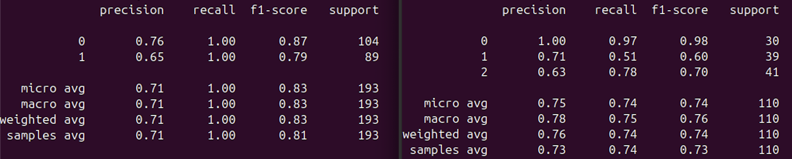
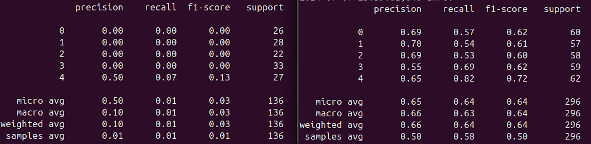
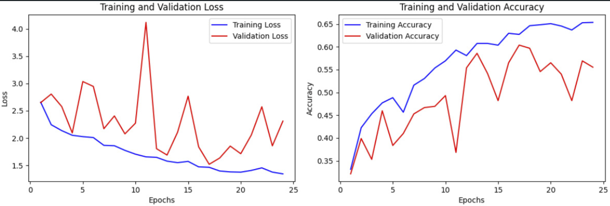

### AI in Python Kimmerle

### Introduction

The goal of this module work is to develop a predictive model that can accurately identify different types and levels of stenosis in lumbar spine images taken from medical MRI scans. For this purpose, a labeled dataset provided by a Kaggle competition is used, which was reduced to a manageable size of approximately 6000 images.

### Procedure and Description of modified Parameters

To begin, a thorough examination of the images, directory structure, and the provided information was crucial. Helper scripts were utilized for displaying the DICOM images, a common datatype for medical scans (see ./show_dicom.py). Given that working with the entire 30GB image dataset was impractical, the number of files was reduced to 1.6 GB (about 6000 files). This reduction was also applied to the CSV files containing the labels using another helper script (resize_csv_to_available.py).

It became evident that working with image datasets - where preprocessing and augmentation are necessary - would demand significant computational resources. Thus, considerable effort was invested in setting up a GitLab pipeline with a remote runner. Although installation on a powerful Windows machine was initially unsuccessful (both inside a Docker container and in shell mode) a fallback-option using an iMac-runner with an i9 processor and 64GB RAM was successful for training on CPU. In late development-phases, after installing Linux OS and gitlab-runner, the CUDA Cores were available on the desired machine.

Research indicated that pretrained networks are a common practice for similar problems. The MONAI framework offers such pretrained networks (e.g., DenseNet121, U-Net, ResNet) and also methods, specifically designed for loading, preprocessing, and augmenting medical images. The classification outputs should identify the lumbar spine level of specific conditions (L1/L2, L2/L3, L3/L4, L4/L5, L5/S1) and five different types of stenosis (e.g., subarticular, foraminal, spinal canal). It is important to note that multiple conditions can be present in a single image.

Initial attempts without much refinement showed reasonable performance in some cases but struggled with accurately classifying the correct levels (L1/L2...), which was close to random guessing. Changing hyperparameters or using a larger dataset did not improve results. Since axial slides of a lumbar spine appear very similar throughout a series, the idea was to provide contextual data to the model. Helper scripts revealed that each 'study' (individual) contained at least three 'series' (MRI scans) and each series typically contained 10-20 images (see count_series.py; count_images_per_series.py). Therefore, a new approach was to use 15 images per series to maintain consistent dimensions and three series per study for a homogeneous representation of specific condition combinations. However, combining 15 images (augmentation or cutting, where neccessary) into a single tensor proved impractical for later decoding of the labelsThe results were poor due to bugs that led to only a single label being assigned to a series.

To leverage shared information between neighboring images, a 2.5-dimensional approach (3 images in the 'channel' of the tensor) was implemented. In this approach, a label were assigned to every central image, even if showing no condition. This approach also did not yield meaningful results. Since the MRI scan images are axial and also radial, further refinement is necessary. To imporove the model, focus was set on the axial images only, since they seemed to hold more information - especially about the earlier harder to predict kinds of stenosis (subarticular left and subarticular right). Although the 3 remaining conditions were clearly visible on these images, they were not labeled, so there is a decition to make between training 2 models for each orientation or to combine labels and only use axial images. In order to use the whole dataset, 2 models were trained.

### Conclusion of Analysis

The developed model can predict specific types of stenosis well and others with mixed results. Spinal-canal stenosis is detected in 100% of the test cases. Level-classification did not perform as good. This might be due to the lack of contextual data or more data should have been used.

On a personal level, this course provided extremely valuable knowledge about git, pipelines/runners, CUDA installations and insights into AI and ML, sparking an interest in further exploring these tools. Persistent issues with Windows machines, upload limits and challenges with labels and dimensions were time-consuming but ultimately educational. A personal goal was to work on something meaningful and learn how to use ML as a useful tool, that it should be.